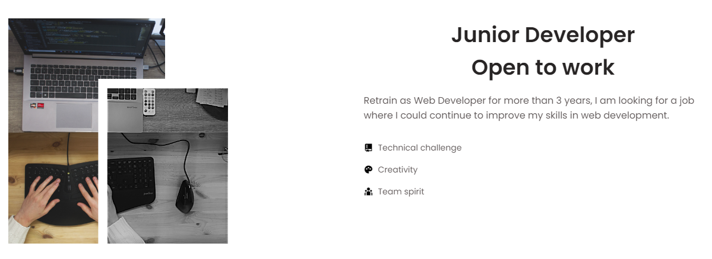

<!-- Banner Image -->

Hi there 👋 Welcome to my github !

<!-- Languages -->
## Languages

      

<!-- Frameworks -->
## Frameworks

<!-- Database -->

<!-- Tools -->
## Tools

<!-- Contact -->
## Contact

